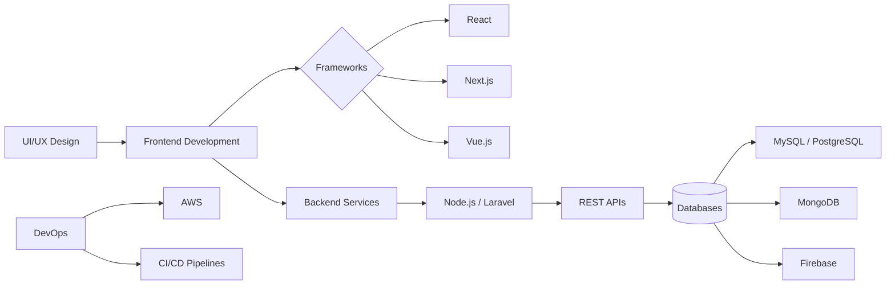

  

<h1 align="center">
  👋 Hi, I’m <a href="https://muqqu.dev">Muqaddam Sheikh</a>
</h1>

  <strong>🚀 Software Engineer | Full-Stack Web Developer</strong> 
  Crafting scalable, high-performance web experiences that deliver real business impact.

  
  
  

---

## 🚀 About Me

I’m a results-driven **Full-Stack Developer** focused on building modern, scalable, and user-centric web applications.

* 💡 I turn ideas into production-ready applications
* ⚡ Strong focus on performance, clean architecture & UX
* 🤝 Open to collaborations, freelance work, and innovative projects
* 📈 Constantly learning and adapting to new technologies

---

## 🧰 Tech Stack

**Frontend**
HTML • CSS • JavaScript • React • Next.js • Tailwind CSS

**Backend**
Node.js • Laravel • Express • REST APIs

**Database**
MySQL • PostgreSQL • MongoDB • Firebase

**Tools & Others**
Git • AWS • CI/CD • Adobe Creative Cloud

---

## 🛠️ Skills Overview

| Technology | Proficiency              |
| ---------- | ------------------------ |
| HTML / CSS | ████████████████████ 95% |
| JavaScript | █████████████████░░ 85%  |
| React      | █████████████████░░ 85%  |
| Next.js    | ████████████████░░░ 80%  |
| Laravel    | ████████████████████ 95% |
| Node.js    | ███████████████░░░░ 75%  |
| Databases  | ██████████████████░ 90%  |
| MongoDB    | ████████████████░░░ 80%  |
| Firebase   | ███████████████░░░░ 75%  |
| Python     | ████████████████░░░ 80%  |
| PHP        | ██████████████████░ 90%  |
| Java       | ███████████████░░░░ 75%  |
| C#         | ██████████████░░░░░ 70%  |

---

## 🏗️ Architecture Approach

---

## 🌟 What I Deliver

✔ Scalable full-stack applications
✔ Clean, maintainable codebases
✔ Fast, responsive UI/UX
✔ API-driven architecture
✔ Deployment-ready solutions

---
---

## 🐍 Contribution Snake

  <picture>
    <source 
      media="(prefers-color-scheme: dark)" 
      srcset="https://raw.githubusercontent.com/Muqqu/Muqqu/output/github-snake-dark.svg" 
    />
    <source 
      media="(prefers-color-scheme: light)" 
      srcset="https://raw.githubusercontent.com/Muqqu/Muqqu/output/github-snake.svg" 
    />
    
  </picture>

## 📬 Let’s Connect

  💼 <a href="https://muqqu.dev">Portfolio</a> • 
  🐙 <a href="https://github.com/Muqqu">GitHub</a> • 
  🐦 <a href="https://twitter.com/your_twitter">Twitter</a>

  <strong>💬 Have a project in mind? Let’s build something impactful together.</strong>

